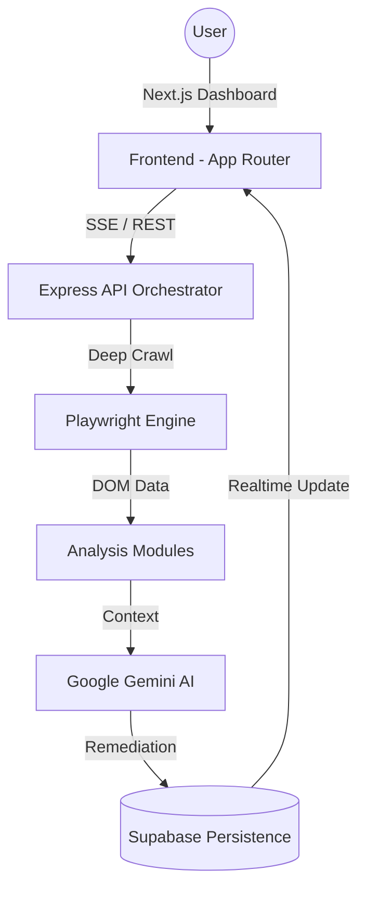

# Autopilot QA 🚀 — Production-Grade AI Website Auditing

[](https://autopilot-qa-web.vercel.app)
[](https://ai.google.dev)

**Autopilot QA** is an advanced, AI-first SaaS platform designed to automate the complex process of website auditing. It goes beyond simple linting by leveraging **Chromium-based deep crawling** and **LLM intelligence** to provide high-fidelity health reports, actionable remediation code, and executive-level summaries.

---

## 🌟 Core Pillars

### 1. **Deep Engine Discovery**
Powered by **Playwright**, our engine executes the full JavaScript stack of modern SPAs (React, Next.js, Vue) to find "hidden" issues that static scanners miss. It respects `robots.txt` but offers an **Owner-Assisted Fallback** if access is blocked by WAFs (Cloudflare).

### 2. **Multi-Vector Analysis**
Every scan evaluates your project across six critical technical vectors:
- **SEO**: Core web vitals, metadata, and crawlability.
- **Accessibility (A11y)**: WCAG conformance and semantic HTML.
- **Performance**: Resource optimization and delivery impacts.
- **Security**: HTTPS health, header safety, and script vulnerabilities.
- **UX**: Visual flow and interactive consistency.
- **Broken Links**: Automated link sanity checks.

### 3. **AI-Driven Remediation**
We don't just report errors; we solve them. Using **Google Gemini AI**, the system generates:
- **Executive Summaries**: High-level overviews for stakeholders.
- **Detailed Explanations**: "Why it Matters" sections for every finding.
- **One-Click Fixes**: Copy-pasteable code blocks to resolve issues immediately.
- **Scan Chat Assistant**: A dedicated sidebar where you can ask, *"What is the most critical security fix for this page?"*

---

## 🏗️ Architecture



---

## 🛠️ Tech Stack

- **Monorepo**: [Turborepo](https://turbo.build/repo)
- **Frontend**: [Next.js 14](https://nextjs.org/), TypeScript, Tailwind CSS
- **State & Sync**: [Framer Motion](https://www.framer.com/motion/), [TanStack Query](https://tanstack.com/query)
- **Backend**: [Express](https://expressjs.com/) + TypeScript
- **Automation**: [Playwright](https://playwright.dev/) + [Cheerio](https://cheerio.js.org/)
- **Database**: [Supabase](https://supabase.com/) (PostgreSQL + RLS)
- **Infrastructure**: Docker, Render (API), Vercel (Web)

---

## 🚀 Getting Started

### 1. Clone & Install
```bash
git clone https://github.com/your-username/autopilot-qa.git
cd autopilot-qa
npm install
```

### 2. Environment Setup
Create `.env` files in `apps/web` and `apps/api` using the provided `.env.example` templates.
Necessary Keys:
- `SUPABASE_URL` & `SUPABASE_ANON_KEY`
- `GROQ_API_KEY` (for AI Engine)
- `NEXT_PUBLIC_API_URL` (for Frontend)

### 3. Launch Development
```bash
npx turbo run dev
```

---

## 📦 Deployment Note

### **Frontend (Vercel)**
- **Root**: `apps/web`
- **Build**: `cd ../.. && turbo run build --filter=web`

### **Backend (Render)**
- **Root**: `apps/api`
- **Environment**: Ensure the Dockerfile is used. 
- **Optimization**: Our specialized launch flags (`--disable-dev-shm-usage`) ensure stability on 512MB RAM free instances.

---

## 🎨 Design Philosophy: Neo-Illustrative Minimalism
The UI utilizes a "frosted-glass" aesthetic with `3xl` rounded corners, soft azure shadows, and a bright, light-themed palette designed to reduce "diagnostic fatigue" while presenting complex technical data.

---
*Created with ❤️ by the Autopilot QA Team.*
